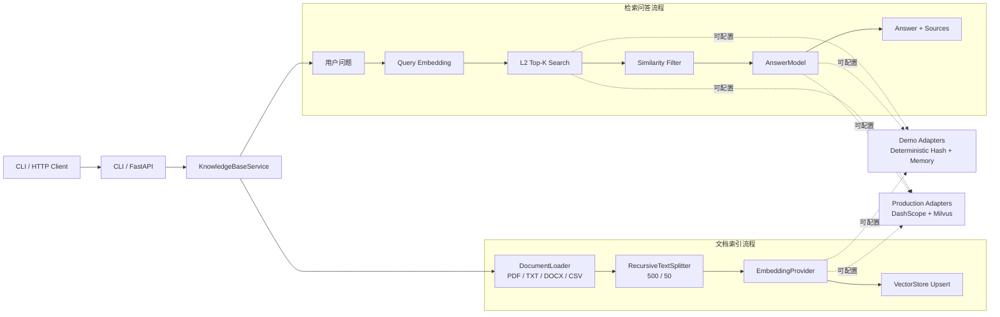

# DocPilot 本地知识库助手

DocPilot 是一个面向学习、作品展示和原型验证的轻量级 RAG 文档问答服务。项目将文档解析、文本切分、向量化、相似度检索和基于证据的回答封装为统一的 CLI 与 REST API，并提供两套可切换后端：

- **演示模式**：确定性哈希向量 + 线程安全内存向量库，无需 API Key 或外部服务。
- **生产适配**：DashScope `text-embedding-v1` / `qwen-plus` + Milvus。

项目保留 6 个常用知识库接口，同时增加健康检查、输入校验、来源回传和可重复的离线测试。它适合用来理解一条完整、可运行的 RAG 链路，也便于继续替换模型或存储组件。

> 项目只实现仓库中能够验证的能力。前端工作台与后端 API 一起提供，默认离线回答器是确定性的演示实现，不会把固定结果伪装成在线大模型。

## 核心能力

- 支持 PDF、TXT、Markdown、DOCX、CSV 文档解析；PDF 保留页码，CSV 保留行号。
- 默认以 500 字符、50 字符重叠切分，并优先在中文标点或换行处断开。
- 通过内容 SHA-256 生成稳定文档 ID；相同内容再次入库时执行幂等替换。
- 支持纯检索与 RAG 问答，统一返回来源切片、原始 L2 距离和相似度分数。
- 以 `EmbeddingProvider`、`VectorStore`、`AnswerModel` 三类接口隔离核心业务与外部依赖。
- 提供 LangChain Embeddings、Document 转换和 `invoke` 风格 Retriever 兼容层。
- 同时提供 CLI、FastAPI、Swagger 文档和 GitHub Actions CI。
- 内置无需构建工具的本地 Web 工作台：上传资料、提问、查看检索来源和服务状态。
- 默认限制上传为 20 MiB；远程部署时可关闭服务端本地路径导入。
- 清空集合必须显式提交 `confirm=true`，降低误操作风险。

## 系统架构



更完整的模块职责和分数说明见 [架构文档](docs/architecture.md)。

## 演示与生产边界

| 模式 | Embedding / 回答 | 向量存储 | 适合场景 |
| --- | --- | --- | --- |
| Demo | 确定性哈希向量、固定证据渲染 | 进程内存 | 本地体验、接口联调、自动化测试 |
| Production | DashScope Embedding、Qwen | Milvus | 验证真实语义检索与生成链路 |

Demo 模式的哈希向量不是训练得到的语义模型，固定回答器也不是大语言模型。它的作用是让解析、切分、入库、检索、引用和 API 合约在无网络环境中稳定复现。

## 快速开始

项目要求 Python 3.10 或更高版本。

```powershell
python -m venv .venv
.\.venv\Scripts\Activate.ps1
pip install -e .
```

macOS / Linux 将激活命令换为 `source .venv/bin/activate`。

无需配置密钥即可运行一条完整的“入库 → 检索 → 回答”链路：

```powershell
docpilot demo examples/company_handbook.txt "代码评审前要做什么？"
```

启动 HTTP API：

```powershell
uvicorn docpilot.api:app --reload
```

启动后可访问：

- Web 工作台：<http://127.0.0.1:8000/>
- Swagger UI：<http://127.0.0.1:8000/docs>
- ReDoc：<http://127.0.0.1:8000/redoc>
- 健康检查：<http://127.0.0.1:8000/health>

## API 一览

| 方法 | 路径 | 用途 |
| --- | --- | --- |
| `POST` | `/upload_document` | 读取 API 服务所在机器的本地文档 |
| `POST` | `/upload_file` | 通过 multipart 上传文档 |
| `POST` | `/search` | 返回相关切片，不生成回答 |
| `POST` | `/query` | 检索证据并生成回答 |
| `GET` | `/collection_info` | 查看集合及当前后端信息 |
| `POST` | `/clear_collection` | 清空集合，需要显式确认 |
| `GET` | `/health` | 查看服务状态和版本 |
| `GET` | `/` | 本地 Web 问答工作台 |
| `GET` | `/meta` | 返回工作台能力和当前后端 |
| `POST` | `/demo/seed` | 载入可立即提问的演示手册（幂等） |

以下命令使用 `curl`；Windows PowerShell 中建议写成 `curl.exe`。

### 1. 导入服务端本地文件

```bash
curl -X POST http://127.0.0.1:8000/upload_document \
  -H "Content-Type: application/json" \
  -d '{"path":"examples/company_handbook.txt"}'
```

`path` 由 API 服务进程读取。部署为远程服务时，建议配置 `DOCPILOT_ALLOW_LOCAL_PATHS=false`。

### 2. 上传文件

```bash
curl -X POST http://127.0.0.1:8000/upload_file \
  -F "file=@examples/company_handbook.txt;type=text/plain"
```

响应示例：

```json
{
  "document_id": "188f57af07e4cf15df79c88754666b0d",
  "source": "company_handbook.txt",
  "chunks_indexed": 1
}
```

### 3. 纯检索

```bash
curl -X POST http://127.0.0.1:8000/search \
  -H "Content-Type: application/json" \
  -d '{"query":"代码评审前要做什么？","top_k":5,"similarity_threshold":0.5}'
```

每个结果均带有切片、来源、分数和原始距离：

```json
{
  "query": "代码评审前要做什么？",
  "results": [
    {
      "chunk": {
        "id": "<chunk-id>",
        "document_id": "<document-id>",
        "text": "提交评审前，开发者需要补充单元测试……",
        "source": "company_handbook.txt",
        "chunk_index": 0,
        "metadata": {"file_type": "txt"}
      },
      "score": 0.60578,
      "distance": 1.57688
    }
  ]
}
```

### 4. RAG 问答

```bash
curl -X POST http://127.0.0.1:8000/query \
  -H "Content-Type: application/json" \
  -d '{"question":"代码评审前要做什么？","top_k":5,"similarity_threshold":0.5}'
```

响应包含 `answer`、当前 `provider` 和完整 `sources`。Demo 模式下 provider 为 `deterministic-demo`；启用 DashScope 后为 `dashscope-qwen`，Qwen 被要求仅基于相同证据回答并使用来源编号。

### 5. 查看集合

```bash
curl http://127.0.0.1:8000/collection_info
```

```json
{
  "collection_name": "docpilot_chunks",
  "entity_count": 1,
  "backend": "memory",
  "metric_type": "L2",
  "dimension": 1536,
  "embedding_provider": "deterministic-hash-demo",
  "answer_provider": "deterministic-demo",
  "default_top_k": 5,
  "default_similarity_threshold": 0.5
}
```

### 6. 清空集合

```bash
curl -X POST http://127.0.0.1:8000/clear_collection \
  -H "Content-Type: application/json" \
  -d '{"confirm":true}'
```

未传入 `confirm=true` 时接口返回 `400`，不会清空数据。

## 使用 DashScope 与 Milvus

安装生产适配依赖并启动 Milvus：

```powershell
pip install -r requirements-production.txt
docker compose up -d
```

复制 `.env.example` 为 `.env`，至少修改：

```dotenv
DOCPILOT_MODE=production
DOCPILOT_VECTOR_BACKEND=milvus
DOCPILOT_AI_BACKEND=dashscope
DOCPILOT_MILVUS_URI=http://localhost:19530
DOCPILOT_DASHSCOPE_API_KEY=your-api-key
DOCPILOT_EMBEDDING_MODEL=text-embedding-v1
DOCPILOT_CHAT_MODEL=qwen-plus
DOCPILOT_ALLOW_LOCAL_PATHS=false
```

不要提交 `.env` 或真实密钥。`production` 用于标识运行模式，外部适配器仍通过 `VECTOR_BACKEND` 与 `AI_BACKEND` 显式选择。

## CLI

```text
docpilot demo <path> <question> [--top-k N] [--threshold SCORE]
docpilot index <path>
docpilot search <text> [--top-k N] [--threshold SCORE]
docpilot query <text> [--top-k N] [--threshold SCORE]
docpilot info
docpilot clear --yes
```

默认内存库仅存在于当前进程，所以离线体验使用 `docpilot demo`。分别执行 `index` 与 `query` 会启动两个进程，内存数据不会保留；切换到 Milvus 后可跨命令持久化。

## 配置项

| 变量 | 默认值 | 说明 |
| --- | --- | --- |
| `DOCPILOT_VECTOR_BACKEND` | `memory` | `memory` 或 `milvus` |
| `DOCPILOT_AI_BACKEND` | `deterministic` | `deterministic` 或 `dashscope` |
| `DOCPILOT_COLLECTION_NAME` | `docpilot_chunks` | 集合名称 |
| `DOCPILOT_CHUNK_SIZE` | `500` | 单个切片最大字符数 |
| `DOCPILOT_CHUNK_OVERLAP` | `50` | 相邻切片重叠字符数 |
| `DOCPILOT_TOP_K` | `5` | 默认召回数量 |
| `DOCPILOT_SIMILARITY_THRESHOLD` | `0.5` | 默认相似度阈值 |
| `DOCPILOT_EMBEDDING_DIMENSION` | `1536` | 向量维度 |
| `DOCPILOT_MAX_UPLOAD_BYTES` | `20971520` | 最大上传字节数 |
| `DOCPILOT_ALLOW_LOCAL_PATHS` | `true` | 是否允许服务端路径导入 |

## 项目结构

```text
docpilot-rag/
├─ src/docpilot/
│  ├─ api.py                 # FastAPI 接口
│  ├─ cli.py                 # 命令行入口
│  ├─ config.py              # 环境配置及校验
│  ├─ dependencies.py        # 后端装配
│  ├─ domain.py              # 文档、切片、检索结果模型
│  ├─ loaders.py             # PDF/TXT/DOCX/CSV 解析
│  ├─ text_splitter.py       # 中文友好的递归切分
│  ├─ embeddings.py          # 哈希与 DashScope Embedding
│  ├─ vectorstores.py        # 内存与 Milvus 向量库
│  ├─ llms.py                # 演示回答器与 Qwen
│  ├─ service.py             # 索引、检索、问答用例
│  └─ langchain_compat.py    # LangChain 兼容适配
├─ tests/                    # 单元与接口测试
├─ examples/                 # 可直接运行的示例资料
├─ docs/architecture.md      # 架构与分数约定
├─ docker-compose.yml        # Milvus 单机依赖
└─ .github/workflows/ci.yml  # pytest + Ruff CI
```

## 测试

```powershell
pip install -r requirements-dev.txt
pip install -e .
pytest --cov=docpilot --cov-report=term-missing
ruff check src tests
```

当前离线基线：Python 3.12 下 **12 passed，覆盖率 74%**。GitHub Actions 会在 push 和 pull request 时执行测试、覆盖率统计及 Ruff 静态检查。

## 当前边界

- PDF 使用原生文本提取，不包含扫描件 OCR。
- 不支持 XLS/XLSX、图片或 Markdown 入库。
- 未实现 BM25、RRF、Reranker、Agent 编排、会话记忆、SSE 或前端工作台。
- Demo 模式用于验证工程链路，不代表真实语义检索效果。
- DashScope 与 Milvus 适配器需要使用者自行提供可用服务和密钥。

## License

[MIT](LICENSE)
